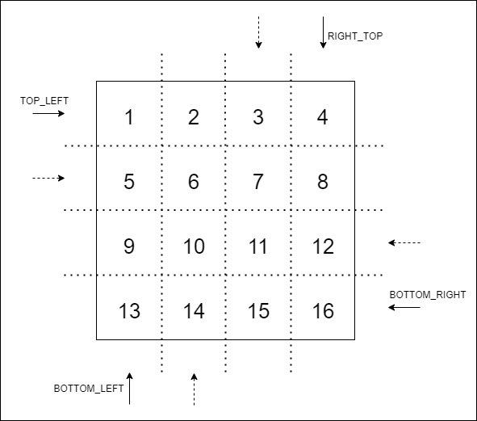

# Spiral Order Traverse Application

---
##### Problem: 

Print m x n 2D Integer array (Matrix) in spiral order


Output should be [1,2,3,6,9,8,7,4,5]

-----
##### Solution
In the solution, there are 4 pointers(top, right, bottom) that move in each iteration and there are 4 directions (Left to right, right to bottom, right to left and bottom to top) 

Initially
- Top pointer starts with the row number of the 2d array ( 0 )
- Right pointer starts with the first array element size (arr[0].length - 1)
- Bottom pointer starts with array element size (arr.length - 1)
- Left pointer starts with the first column number ( 0 )


The first traverse direction is left to right and it starts from left pointer and ends in right pointer. After it finishes its traverse, top pointer moves downwards by 1 since the first row is already traversed. 

From the end point of the first iteration the new traverse iteration starts from tops to down. After it finishes its traverse right pointer moves to left by 1 since the rightest column was already traversed. 

From the end point of the second iteration the new traverse iteration starts from right to left. After it finishes its traverse down pointer moves upward by 1 since the downest row was already traversed. 

From the end point of the third iteration the new traverse iteration starts from down to top. After it finishes its traverse left pointer moves right by 1 since the leftest column was already traversed. 

Then it starts over from left to right and the cycle continues until each element is visited. 



----
#### Build & Test
```shell
cd traversing-matrix
mvn clean install
```
